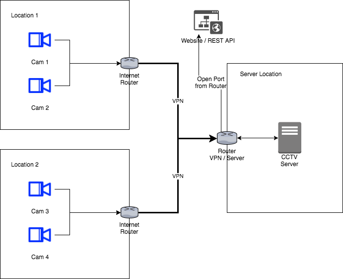

# Django_CCTV

Django-CCTV is a simple video surveillance software based on https://www.djangoproject.com, http://mezzanine.jupo.org,
https://github.com/arut/nginx-rtmp-module/ & https://www.libav.org.

Right now the software is just a very early version and need more testing.

Funktions:
- recording video stream to mp4
- motion detection
- delte old records automatic to save space
- dyn dns client to cloudflare
- manage cams through the web interface

## Todo

- Website Monitor (Test if website access able)
- change nginx user
- change record interval